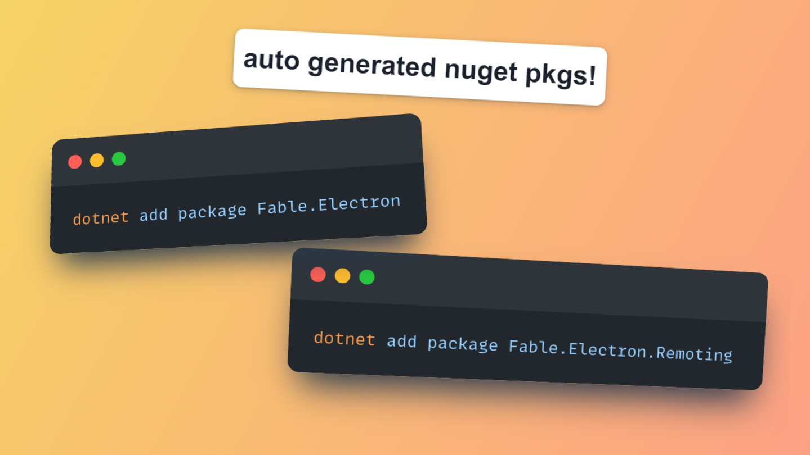

# Fable.Electron

Fable bindings for [Electron](https://electronjs.org/).

[See the documentation.](https://fable-hub.github.io/Fable.Electron/)

Contributions are welcome!
--------------------------

**Pull requests are more than welcome**, whether it’s bindings for new APIs, new helpers, bugfixes, or just improving typos and formatting in the documentation. If you want to create a PR with non-trivial changes, consider opening an issue first so you don’t waste time and effort on something that might not be accepted or might already be underway.

## Deployment checklist

1. Make necessary changes to the code
2. Make commits strictly following conventional commits standards
3. Push to remote. Release notes and packages are automatically published to github and NuGet.
