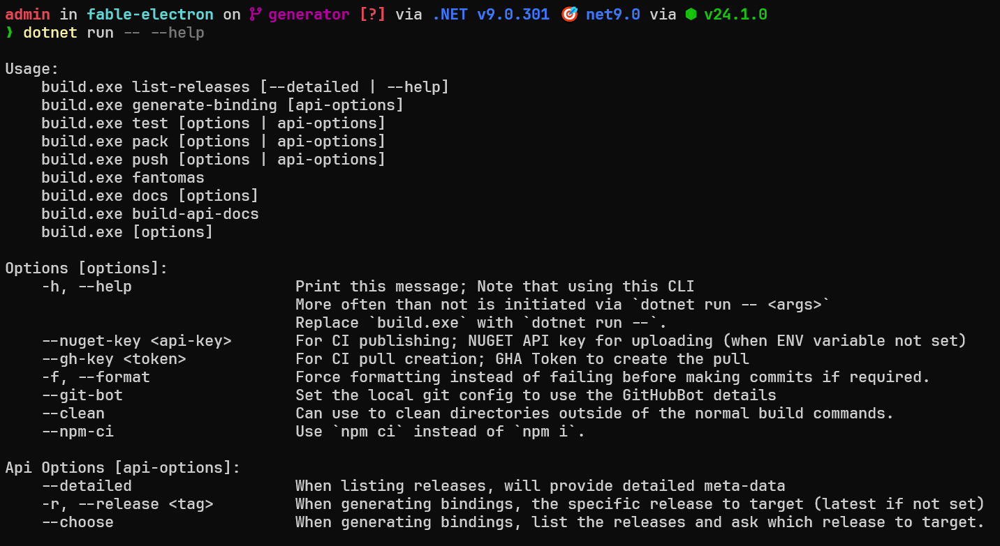
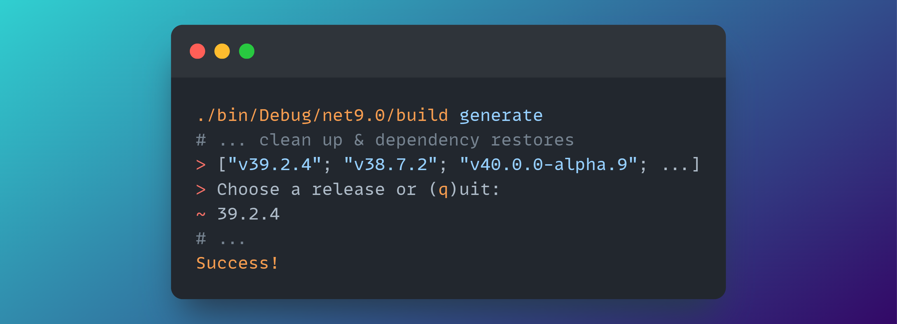
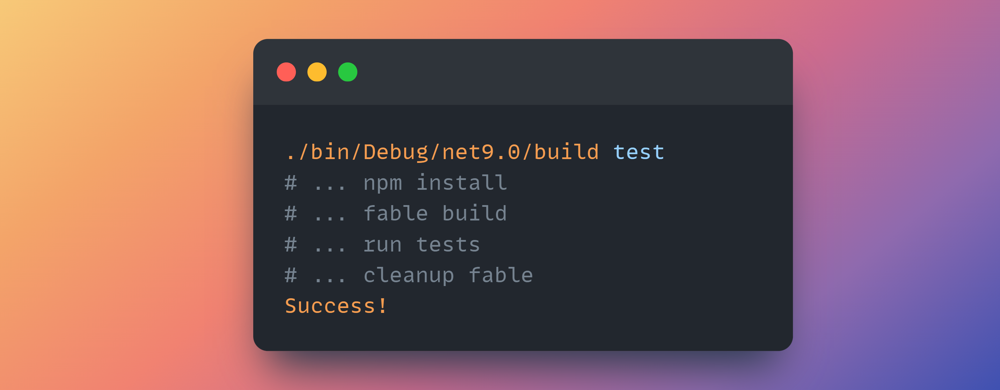
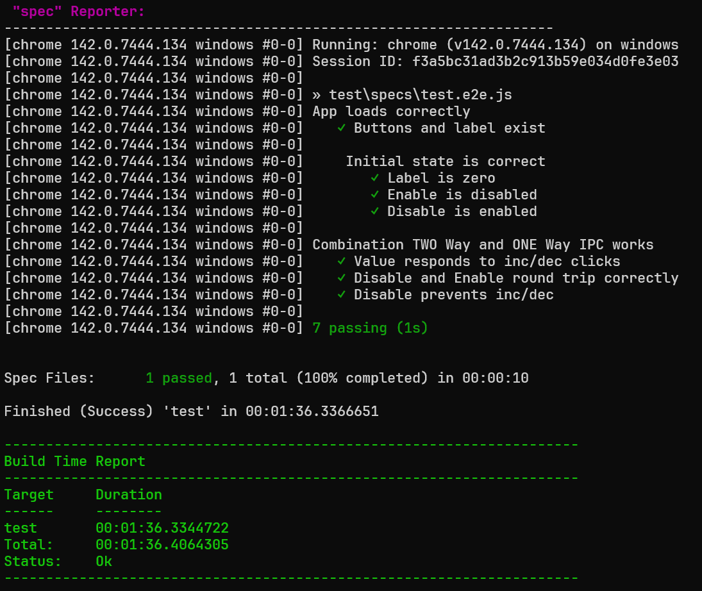
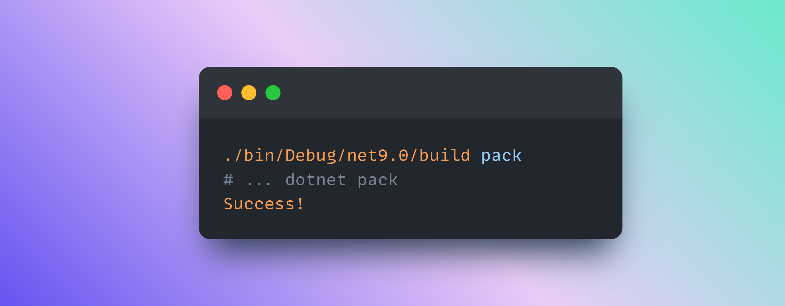

---
slug: generating-a-binding
title: Generating a Binding
authors: [cabboose]
tags: [guide]
---

You can use the `Fable.Electron` build cli to generate a binding for a specific version of electron if it is compatible.

Let's see how!

<!-- truncate -->

:::important
The build process utilises the `GitHub CLI`, please install it before proceeding.

[Visit the official website.](https://cli.github.com/)
:::

If you haven't done so already, first clone the repository, and make sure you have a
compatible version of the .NET SDK.

Navigate to the root of the repository and run

```bash
dotnet run -- --help
# or
dotnet run
```

:::tip
The arguments after `--` are sent to the run project rather than being evaluated by dotnet.
:::



:::tip
I like to utilise the last build output when I'm reusing the cli,
so I just run `./bin/Debug/net9.0/build <COMMAND> [options]` after (this skips building).
:::

There's a few commands that can be used, but the ones we're interested in are `download`, `generate`, `pack` and `test`.

### Download

Download will retrieve an `electron-api.json` from an electron release (which is what the generator uses to make the source code).

If you haven't already downloaded one, then you can skip this step and just use `generate` (as this will download one if none are found).

### Generate

This will create the source code for the bindings.



> You can use the `--release <VERS>` flag to skip the input request if you know what version you are after.

Make sure to run a test to ensure the bindings are functional.

> You'll need to change the electron version in `tests/Fable.Electron.Remoting.Tests/package.json` to match the generated binding.



> If you get module missing errors then add the `--npm-ci` flag.



:::warning
Keep in mind, perhaps the version you are generating the binding for is not compatible
with our tests.

At least make sure the bindings pack without errors.
:::

Following this, we'll pack the bindings for our use:



You now have your `Fable.Electron.X.X.X.nupkg` in the root `bin` directory!

You can add that to a local nuget index and then install it to your project. Or just use the `.dll` in the `Fable.Electron` project directory.

If there are any issues with this, feel free to drop an issue!

Thanks,
Shayan
