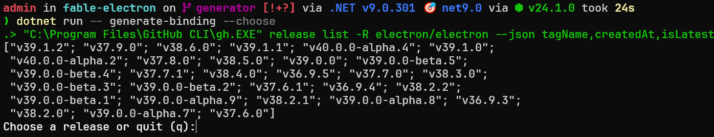
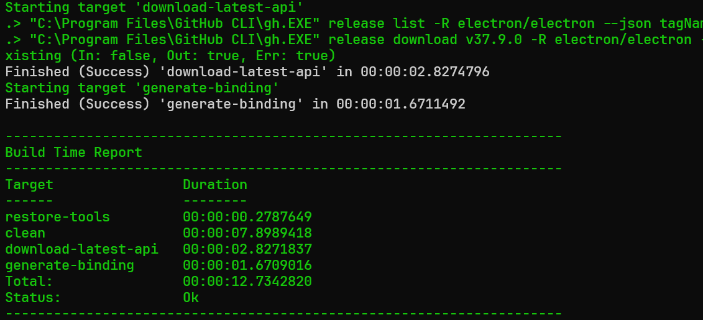
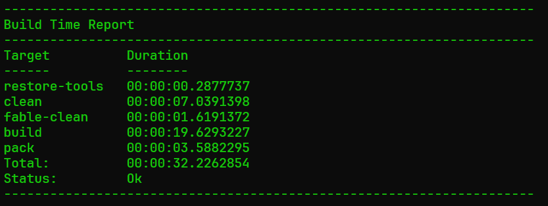

---
slug: generating-a-binding
title: Generating a Binding
authors: [cabboose]
tags: [guide]
---

You can use the `Fable.Electron` build cli to generate a binding for a specific version of electron if it is compatible.

Let's see how!

<!-- truncate -->

:::important
The build process utilises the `GitHub CLI`, please install it before proceeding.

[Visit the official website.](https://cli.github.com/)
:::

If you haven't done so already, first clone the repository, and make sure you have a
compatible version of the .NET SDK.

Navigate to the root of the repository and run

```bash
dotnet run -- --help
```

:::tip
The arguments after `--` are sent to the run project rather than being evaluated by dotnet.
:::


We have a few options to choose from, but we want to utilise the `generate-binding`
command with the `--choose` flag.

```bash
dotnet run -- generate-binding --choose
```



For the sake of this example, I'll choose an older version `37.9.0`



Make sure to run a test to ensure the bindings are functional.

> You'll need to change the electron version in `tests/Fable.Electron.Remoting.Tests/package.json` to match the generated binding.

```bash
dotnet run -- test
# If you get module missing errors then use this instead:
dotnet run -- test --npm-ci
```


:::warning
Keep in mind, perhaps the version you are generating the binding for is not compatible
with our tests.

At least make sure the bindings pack without errors.

```bash
dotnet run -- pack --skip-test
```
:::

Following this, we'll pack the bindings for our use:

```bash
dotnet run -- pack
# if you need to skip the tests, add --skip-test
```



You now have your `Fable.Electron.X.X.X.nupkg` in the root `bin` directory!

You can add that to a local nuget index and then install it to your project. Or just use the `.dll` in the `Fable.Electron` project directory.

If there are any issues with this, feel free to drop an issue!

Thanks,
Shayan
