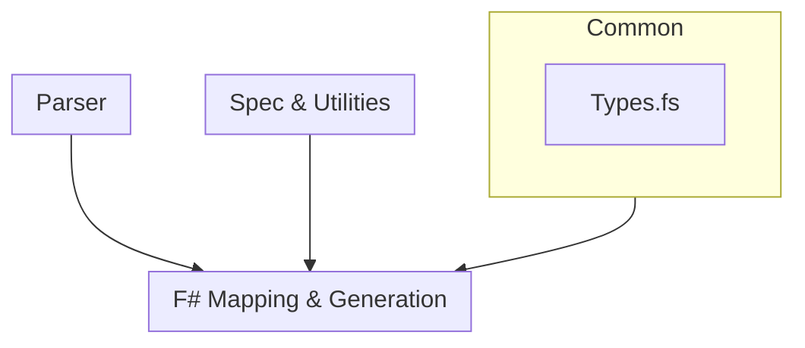

# Types

From the `Prelude` step and moving on, there are ubiquitous types that are
primarily involved with tracking the _access path_ of a API surface.

## Name

A simple DU that always persists the source material string. This allows us to reference the source material string in emissions, even after modifications.

We can access the source value via the property `.ValueOrSource`, and can access
the modified value (or the source if it was unmodified) via `.ValueOrModified`.

## Path

Recursive types that create a chain of parent/child relationships to signify the
path of access. These are compiled into a wrapper DU named `PathKey` which
provides a unified interface for using the types.

When a `PathKey` is provided to the binding `tracePathOfEntry`, it will return
the list of `Name`'s to arrive at the destination. This is how we derive the names
of generated string enums et al.

### Cache

Since we map process specific types into wrapper modules such as `Main`, a 
to the type by name will not work if it is originating from another module.

Therefore, we cache the original name of types against their generated `PathKey`'s,
and refer to this when we arrive at a type value that is a reference to an unknown
object.

The cache is searched for that name, and the path is returned if successful. On
failure, we typically just emit the string directly. If the source is invalid
because no type exists by that name, then we must determine where the dependency
lies, and either bind it ourselves, or include the dependency from another Fable
binding.
