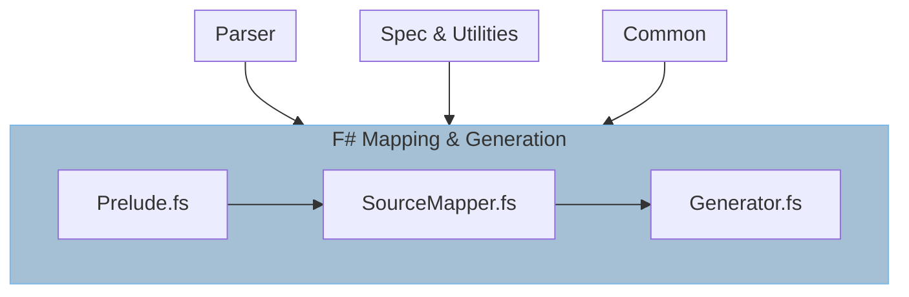

---
title: Source Generation
---

# Source Generation

## Prelude

The source generation process begins with preliminary remapping of the parsed
API into types that are more 'F#/Fable'-centric in `Prelude`.

As this is done, we cache information for types that are going to be generated
later such as delegates, string enums, and event interfaces.

## Processing

Following the prelude, we define the mapping of our internal types to `Fantomas`,
and condensation of information into unified records such as `GeneratorContainer`
with which we can provide a single compilation method that acts across their
unified API, generating attributes/docs easier.

## Generation

The generation step then provides the bindings and helpers to actioning the
process from start to end; while also retrieving cached types/values and
adding them to the generated source.

### `GeneratorGrouper`

The `GeneratorGrouper` type signifies a F# `module` as opposed to the conceptual
module of electron is reflected more accurately by an F# `type` (class).

These are used to group children types and finalized into `Fantomas` en masse.
