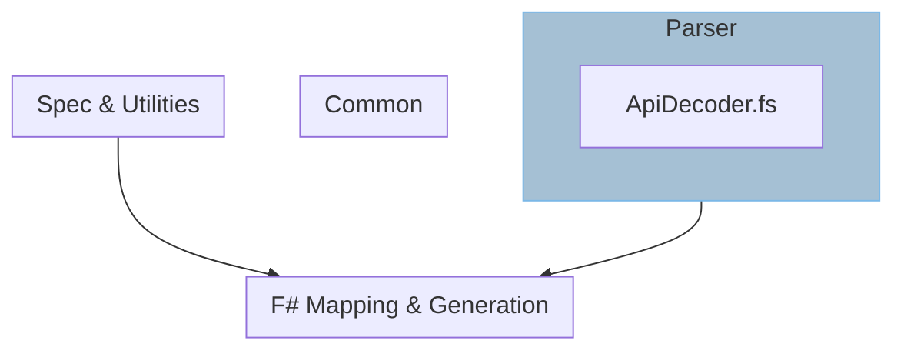

---
title: Parser
sidebar_position: 0
---

# Parsing

The logic for the `electron-api.json` parser is contained entirely within the file
`ApiDecoder.fs`. The Schema is derived from `@electron/docs-parser`.

As the types/schema of the JSON is declared, the `Thoth` decoder is declared in a
module named after the type.

