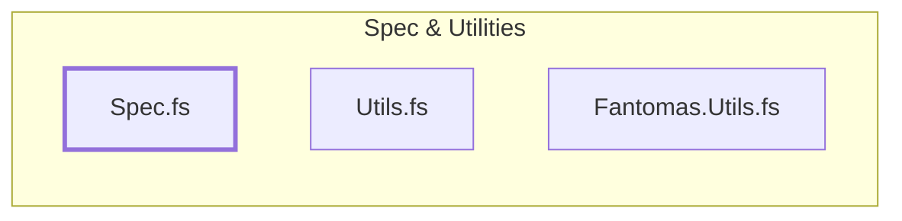

# Specifications



The `Spec.fs` file contains constants, prebaked types and other static definitions
that we want accessible and modifiable from a central location no matter where
they are used in the library.

## Constants

The root namespace, prebaked/predefined type names, and the OS project definition
values.

```fsharp title="Example"
[<Literal>]
let rootNamespace = "Fable.Electron"
```

## Name Remapping

A frozen dictionary of case-sensitive string values with the desired output.
This is applied by our casing functions before anything else in the utilities.

## Reserved Keywords

Set of case sensitive strings that are either apostrophised or stropped, or
otherwise handled to prevent collisions when generating the source.

## Prebaked Type Definitions

Type definitions using `Fantomas` in cases where the type depends on other
generated material and cannot be localised to the helper `Types.fs` file in
the final `Fable.Electron` projoect.
