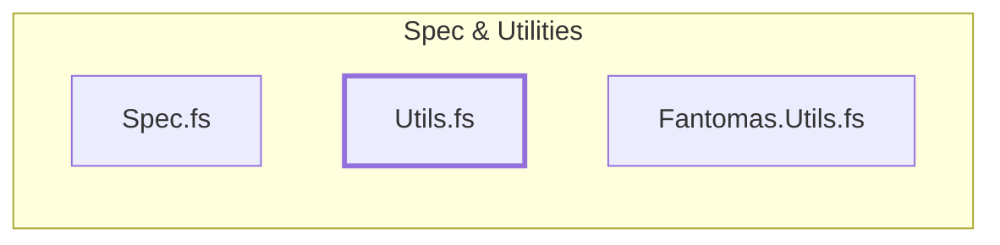

# Utilities

```mermaid
flowchart 
    subgraph spec ["Spec & Utilities"]
        direction TB
        Spec.fs
        Utils.fs
        Fantomas.Utils.fs
    end
    style Utils.fs stroke-width:3px
```

The `Utils.fs` file contains helper functions and bindings utilised repeatedly
in the library such as `toPascalCase`, and XmlDoc related string operations.
