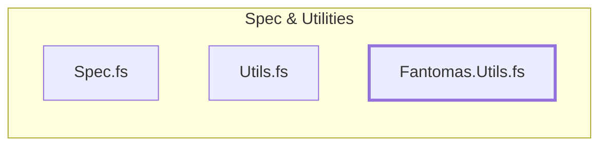

---
title: Fantomas
---

# Fantomas Utilities

`Fantomas.Utils.fs` provides extensions to `Fantomas` syntax oak types that
make creating nodes easier for common use cases.

> The `Fantomas.Utils.fs` was based off a contributors work on a previous project
> which ascribes the different API naming of `.make` and now `.Create` for some
> API.
