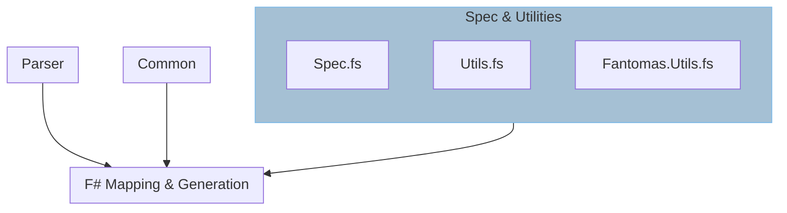

---
sidebar_position: 0
---

# Specification & Utilities

The `Spec.fs` file contains constants, prebaked types and other static definitions
that we want accessible and modifiable from a central location no matter where
they are used in the library.

The `Utils.fs` file contains helper functions and bindings utilised repeatedly
in the library such as `toPascalCase`, and XmlDoc related string operations.

`Fantomas.Utils.fs` provides extensions to `Fantomas` syntax oak types that
make creating nodes easier for common use cases.

> The `Fantomas.Utils.fs` was based off a contributors work on a previous project
> which ascribes the different API naming of `.make` and now `.Create` for some
> API.

:::note
There are a couple utility methods that utilise types from source generation such
as `Name`. This explains why it is compiled after `Types.fs`.
:::

