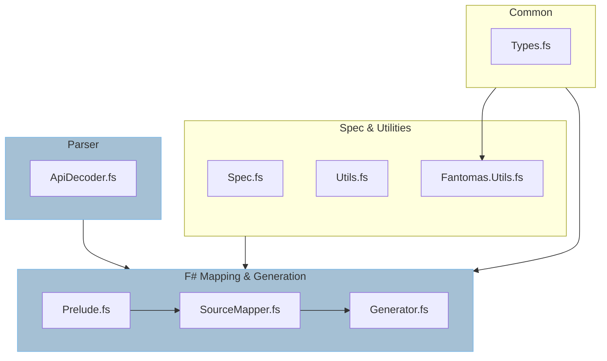

---
title: Introduction
sidebar_position: 0
---

# Development Introduction

This series of documentation relates to the contribution and development of the
`Fable.Electron` generator and libraries.

## Technologies

The project utilises `Fantomas` and `Thoth.Net.Json`.

`Fantomas` is used for source generation, while `Thoth.Net.Json` is utilised in
the parsing of the `electron-api.json` document from which our source is generated.

## General Structure

