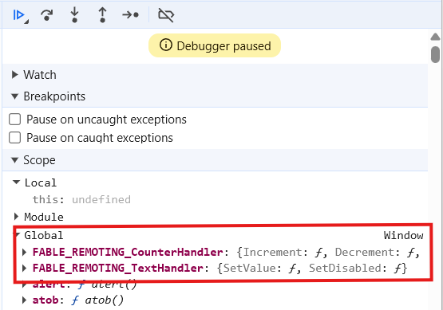

---
title: Remoting Config
---

# Configuration

There are few changes that can be done to change the default behaviour of the
proxy builds.

You should also be aware that the `Fable.Electron.Remoting.Main` module has
an extra config compared to the others.

On all process modules (`Main`, `Preload`, and `Renderer`), start from `Remoting.createIpc()`.

---

When the proxies are created on the `Renderer` side, they are exposed via the `Preload` step on the `window` object as a property.

The name of this property is created based on the combination of a 'base' name
in the config and the name of your Record type.

By default, the prefix is `FABLE_REMOTING` and it is mapped with the type name
as follows:

```fsharp
$"{baseName}_{typeName}"
```

<details>
<summary>Example</summary>

Using the debugger, you can navigate to `Sources` and `pause` so that you can view the window properties in `Scope - Global`.

```fsharp
type TextHandler = { ... }
type CounterHandler = { ... }
```

```fsharp title="Preload Process"
let apiNameMap = fun baseName typName ->
    $"{baseName}_{typName}"
Remoting.createIpc ()
|> Remoting.withApiNameBase "FABLE_REMOTING"
|> Remoting.withApiNameMap apiNameMap
|> Remoting.buildTwoWayBridge<CounterHandler>
Remoting.createIpc ()
|> Remoting.withApiNameBase "FABLE_REMOTING"
|> Remoting.withApiNameMap apiNameMap
|> Remoting.buildBridge<TextHandler>
```


</details>


Similarly, the `Main` and `Preload` step share a named communication - `channel-name`.

The `channel-name` is unique for each record field, and is a combination of
the type name and the field name, which is mapped by default as follows:

```fsharp
$"{typeName}:{fieldName}"
```

<details>
<summary>Example</summary>

```fsharp
type TextHandler = {
    SetValue: ...
    SetDisabled: ...
 }
type CounterHandler = {
    Increment: ...
    Decrement: ...
 }
```

```fsharp title="Preload Process"
let channelNameMap = fun typName fieldName ->
    $"{typName}_{fieldName}"
Remoting.createIpc ()
|> Remoting.withChannelNameMap channelNameMap
|> Remoting.buildTwoWayBridge<CounterHandler>
Remoting.createIpc ()
|> Remoting.withChannelNameMap channelNameMap
|> Remoting.buildBridge<TextHandler>
```

Would use the channels `CounterHandler_Increment`, `CounterHandler_Decrement`, `TextHandler_SetValue` and `TextHandler_SetDisabled`.

</details>

## Common

```fsharp title="Api Name Base"
Remoting.createIpc ()
|> Remoting.withApiNameBase "FABLE_REMOTING"
```

```fsharp title="Api Name Mapping"
Remoting.createIpc ()
|> Remoting.withApiNameMap (fun baseName typeName -> $"{baseName}_{typeName}")
```

```fsharp title="Channel Name Mapping"
Remoting.createIpc ()
|> Remoting.withChannelNameMap (fun typeName fieldName -> $"{typeName}:{fieldName}")
```

## `Main` Specific

When using `Remoting.buildProxySender` on the `Main` process, you will be required to
pass all the windows that you wish to send the messages to.

```fsharp
Remoting.createIpc ()
|> Remoting.withWindow mainWindow // repeat this as many times as required

// alternatively, create your array of windows and feed it in
let windows = [| ... |]
Remoting.createIpc ()
|> Remoting.setWindows windows
```
